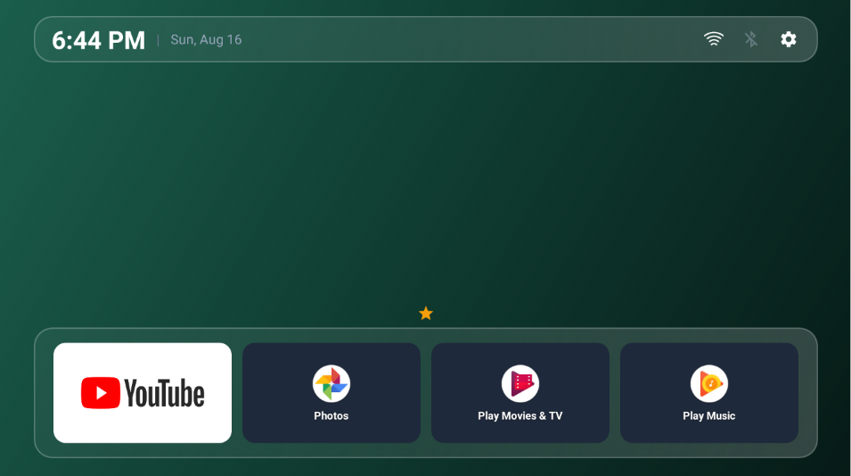
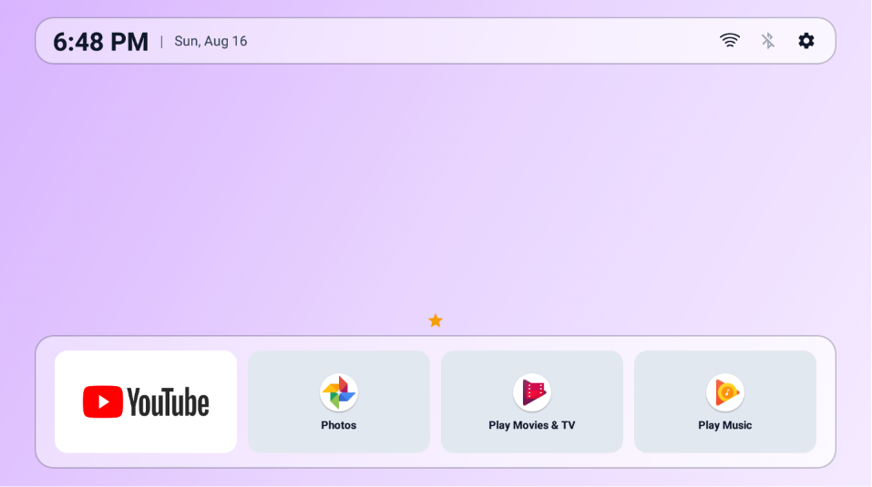
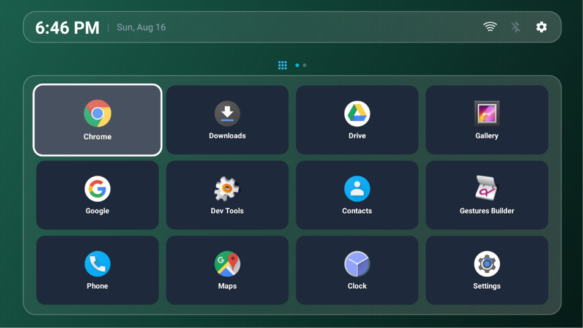
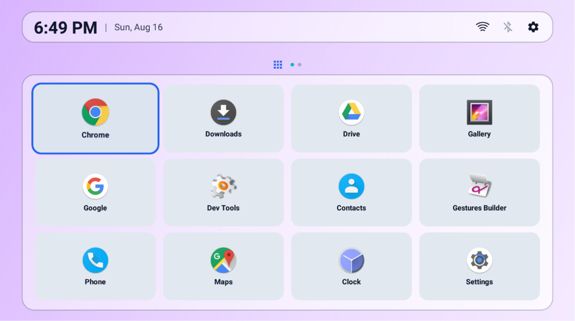
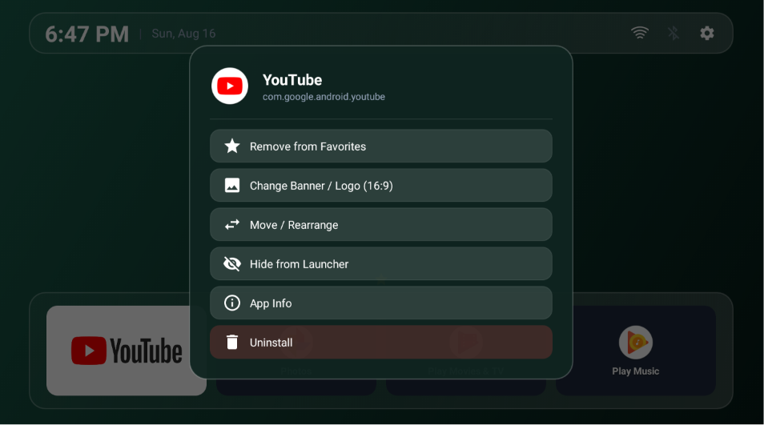
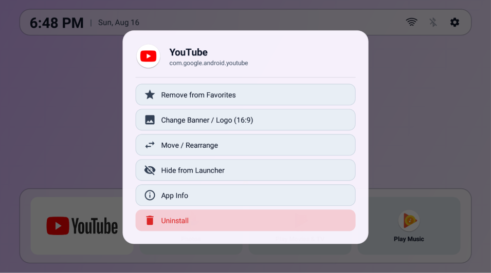
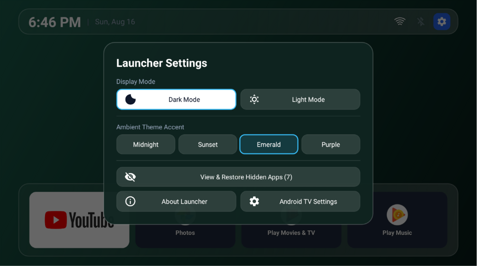
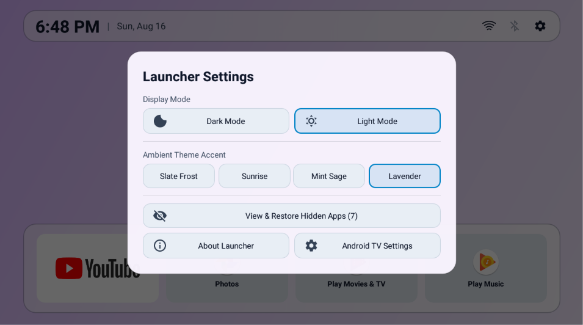

# AndSmartTV Launcher 📺
### *Android Smart TV Launcher for Android Nougat (7.1+) & Newer*

[](https://developer.android.com/tv)
[-green.svg)](https://developer.android.com)
[](LICENSE)
[-brightgreen.svg)](https://github.com/dnsalcedo01/AndSmartTV-launcher/releases)
[](#-inspiration-purpose--open-source)

**AndSmartTV Launcher** (short for *Android Smart TV Launcher*)
is a modern, glassmorphic Leanback launcher natively designed for Android TV boxes. It delivers a fluid, premium TV experience with 16:9 banner support, app reordering, dynamic ambient themes, and remote-optimized navigation.

---

## 💡 Inspiration, Purpose & Open Source

### Project Inspiration
This launcher was crafted with design and usability inspiration drawn from some of the best Android TV launchers:
- **Projectivity Launcher**
- **Monet Launcher**
- **AT4K Launcher**
- **ATV Launcher**

### Why AndSmartTV Launcher Was Created
Most modern Android TV launchers require Android 8.0, 9.0+, or newer Android versions, dropping support for older and budget Android TV boxes running **Android Nougat (v7.1.0 / v7.1.1 / v7.1.2)**. **AndSmartTV Launcher** was specifically developed to bring a modern, glassmorphic, and customizable Leanback launcher experience to budget and legacy Nougat TV boxes (API 25+) as well as newer devices.

### 100% Free & Open Source
This project is **100% free and open-source software (FOSS)**:
- ✅ No features locked behind a paywall
- ✅ No in-app purchases or subscriptions
- ✅ No tracking or telemetry
- ✅ No ads

---

## 📸 Visual Showcase

### 1. Favorite Apps Dock (Stage 1)
| Dark Mode | Light Mode |
| :---: | :---: |
|  |  |

### 2. All Apps & Games Section (Stage 2)
| Dark Mode | Light Mode |
| :---: | :---: |
|  |  |

### 3. Long-Press App Options Menu
| Dark Mode | Light Mode |
| :---: | :---: |
|  |  |

### 4. Launcher Settings
| Dark Mode | Light Mode |
| :---: | :---: |
|  |  |

---

## ✨ Key Features

- 💎 **Glassmorphic Interface**: Frosted glass docks with smooth scrolling animations and clean focus highlights.
- 📱 **16:9 TV Banner/Logo Support**: Displays official wide 16:9 TV app banners or logos, with custom image picker support for sideloaded apps.
- ⭐ **Favorite Apps Dock**: Fast access to your favorite pinned apps with smooth navigation between sections.
- 🎨 **Ambient Themes / Adaptive Colors**:
  - **Dark Mode**: Midnight Slate, Sunset Horizon, Emerald Forest, and Royal Purple.
  - **Light Mode**: Slate Frost, Sunrise, Mint Sage, and Lavender.
- 📊 **Real-Time Status Bar**:
  - Digital Clock & Date
  - Wi-Fi & Ethernet connection status
  - Bluetooth status
  - Dynamic **VPN connection indicator**
  - USB / Flash drive detection
  - Quick-access Settings button
- 🎮 **Remote Control Optimized**: Full support for TV remote controls (D-Pad, OK, Back, and Menu buttons).
- 👁️ **Hide & Restore Apps**: Easily hide unwanted pre-installed apps and restore them anytime from Settings.

---

## 🛠️ Building & Installation

### Prerequisites
- JDK 17+
- Android SDK (API 25 / Android Nougat+)
- Android TV device or emulator

### 1. Build from Source
```bash
# Clone the repository
git clone https://github.com/dnsalcedo01/AndSmartTV-launcher.git
cd AndSmartTV-launcher

# Build debug APK
./gradlew assembleDebug
```
The compiled APK will be located at: `app/build/outputs/apk/debug/app-debug.apk`

### 2. Install on Android TV via ADB
```bash
# Connect wirelessly to your Android TV
adb connect <YOUR_TV_IP>:5555

# Install the APK
adb install -r app/build/outputs/apk/debug/app-debug.apk

# Launch the app
adb shell am start -n com.andsmarttv.launcher/.ui.MainActivity
```

---

## 👤 Author

- **Developer**: [dnsalcedo](https://github.com/dnsalcedo01)
- **Repository**: [https://github.com/dnsalcedo01/AndSmartTV-launcher](https://github.com/dnsalcedo01/AndSmartTV-launcher)

---

## 📄 License

This project is licensed under the **MIT License** - see the [LICENSE](LICENSE) file for details.
